```{r setup, include=FALSE}
options(htmltools.dir.version = FALSE)
knitr::opts_chunk$set(
  fig.width=9, fig.height=3.5, fig.retina=3,
  out.width = "100%",
  cache = FALSE,
  echo = TRUE,
  message = FALSE, 
  warning = FALSE,
  hiline = TRUE
)
```

```{r xaringan-themer, include=FALSE, warning=FALSE}
library(xaringanthemer)
style_duo_accent(
  primary_color = "#1381B0",
  secondary_color = "#FF961C",
  inverse_header_color = "#FFFFFF"
)
```
```{r xaringan-extra, include=FALSE, warning=FALSE, echo=FALSE}
library(xaringanExtra)
use_xaringan_extra(
  c("tile_view", "panelset", "share_again", "editable")
)

use_scribble(
  pen_color = "#d33f49",
  pen_size = 4,
  palette = c("#d33f49", "#466683", "#338d70", "#c0af3f", "#ff6300")
)
```


class: center, middle
# Manual do Sistema de Gestão - Regionais SEBRAE

.pull-left[

]

.pull-right[
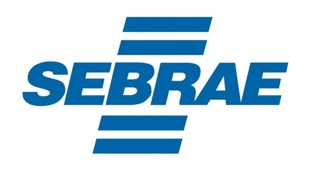
]

---
## Sumário

# atualizar

Link de acesso ao sistema....................................................................  
Logar no sistema..............................................................................  
Trocar a senha de acesso......................................................................  
Esqueci minha senha...........................................................................  
Visualizar e exportar encontros por solução...................................................  
Visualizar e exportar execução dos municípios.................................................

---
**Link do sistema:** [http://sp-hlg.cidadeempreendedora.com.br/#/cidade](http://sp-hlg.cidadeempreendedora.com.br/#/cidade/)  

Login e senha no caminho acima, e aparecerá esta tela


.center[.full-width[
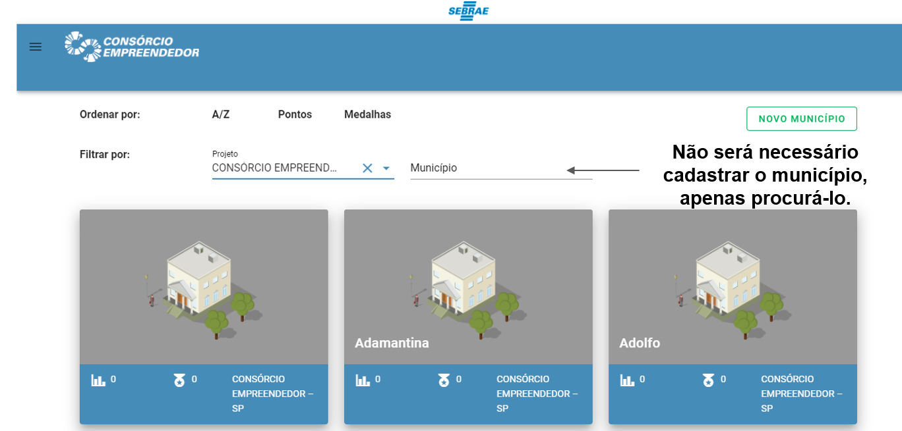
]]

---
.center[.full-width[
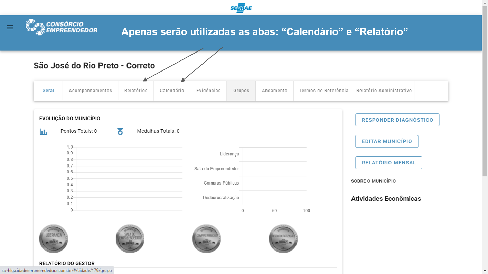
]]

---
.center[.full-width[
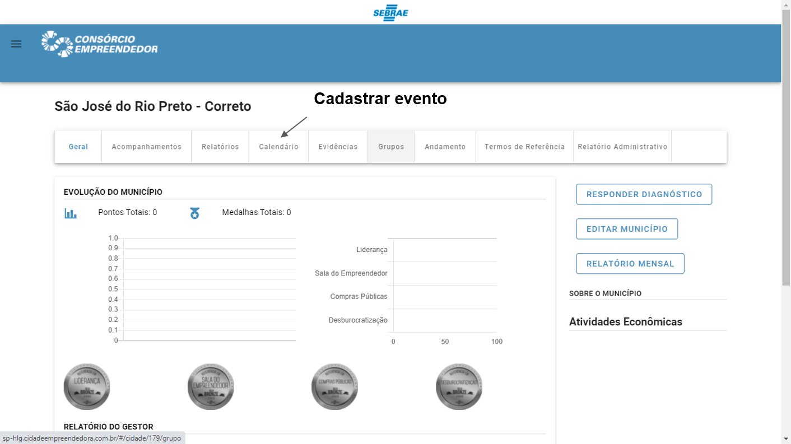
]]


---
.center[.full-width[
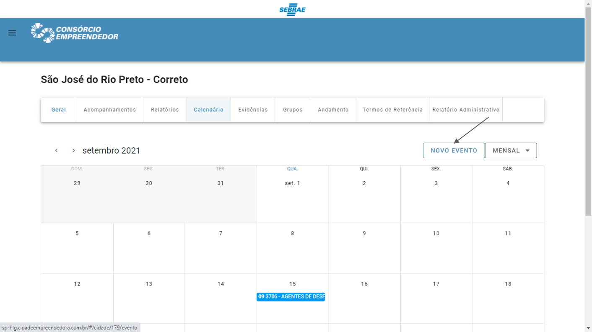
]]

---
.center[.full-width[
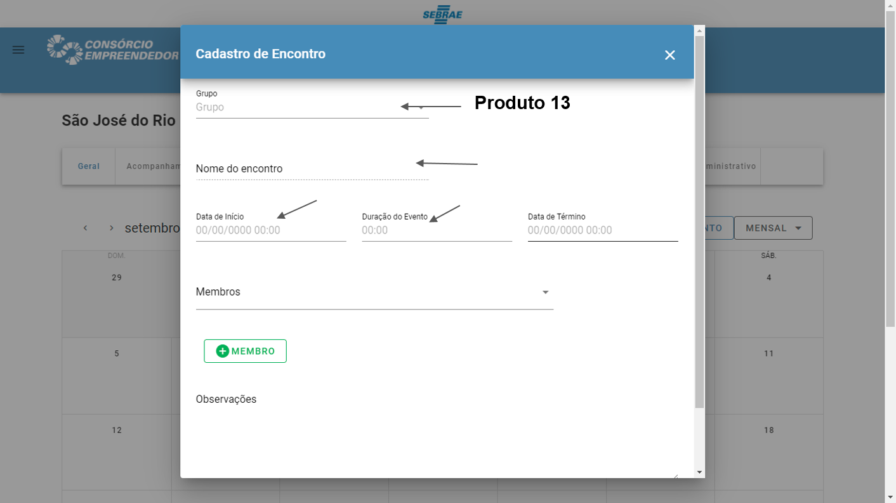
]]
---

.center[.full-width[
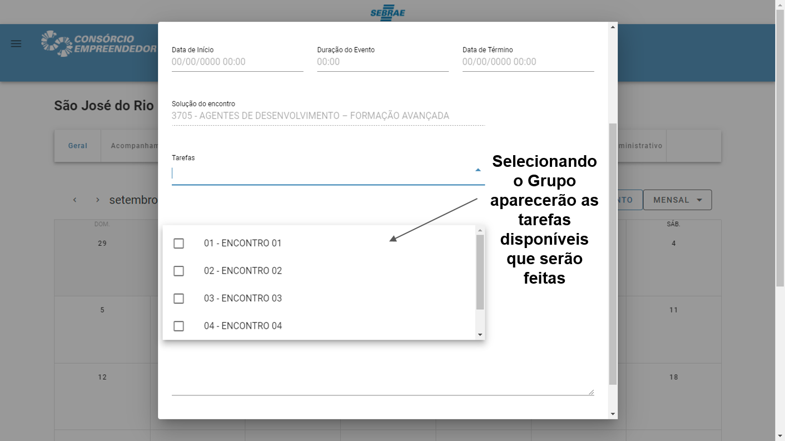
]]
---

.center[.full-width[
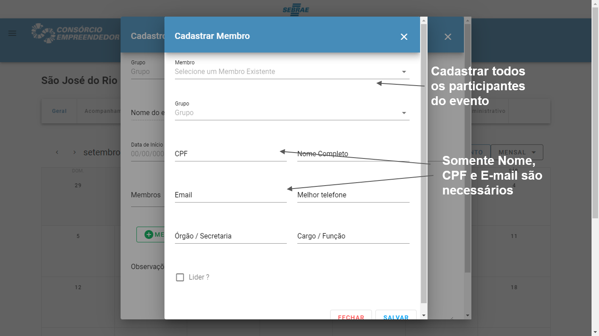
]]
---
.center[.full-width[
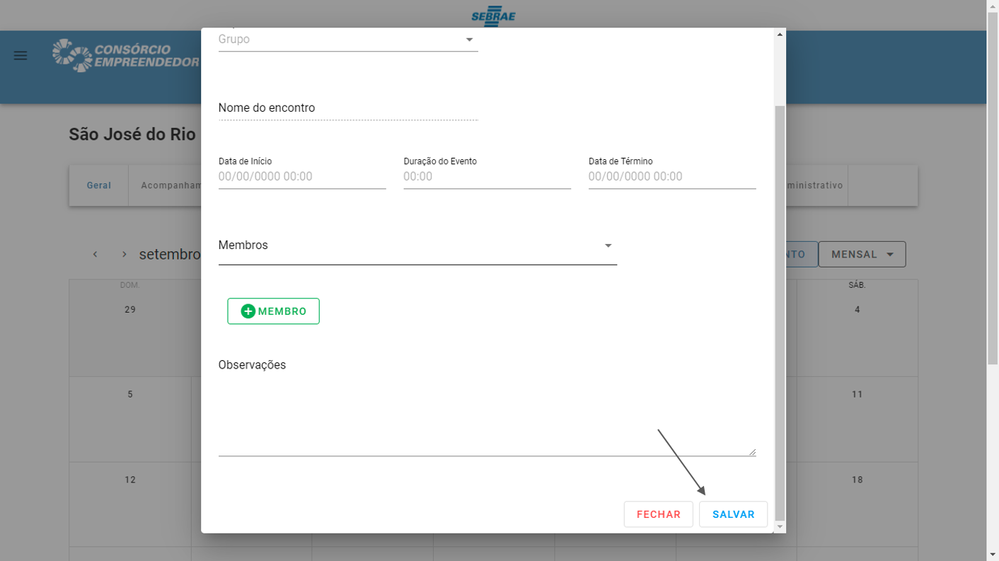
]]

---
.center[.full-width[
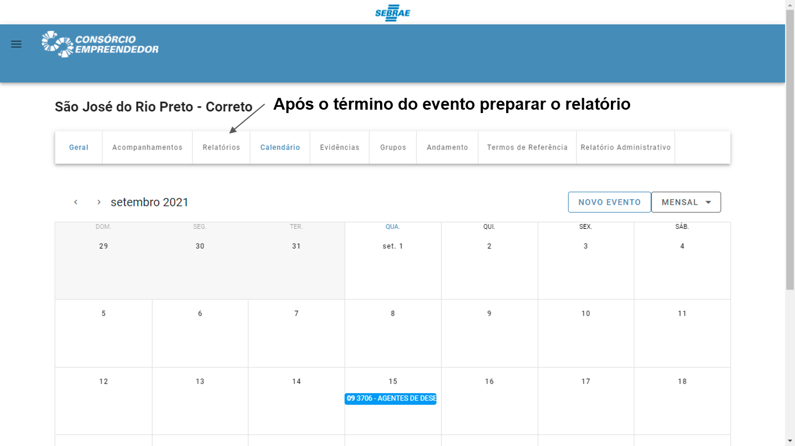
]]     

---
.center[.full-width[
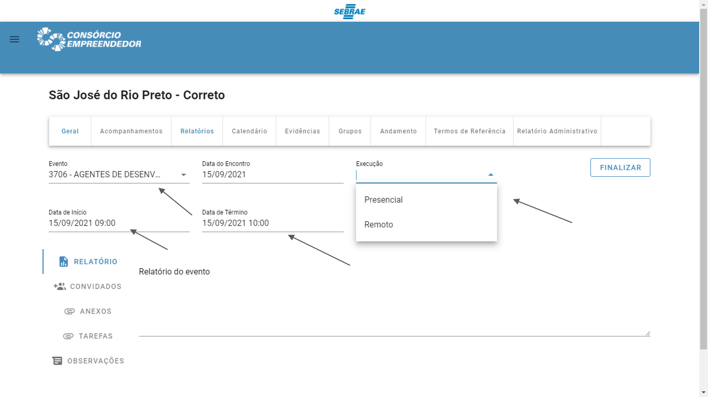
]]     
---
.center[.full-width[

]]     

---
.center[.full-width[
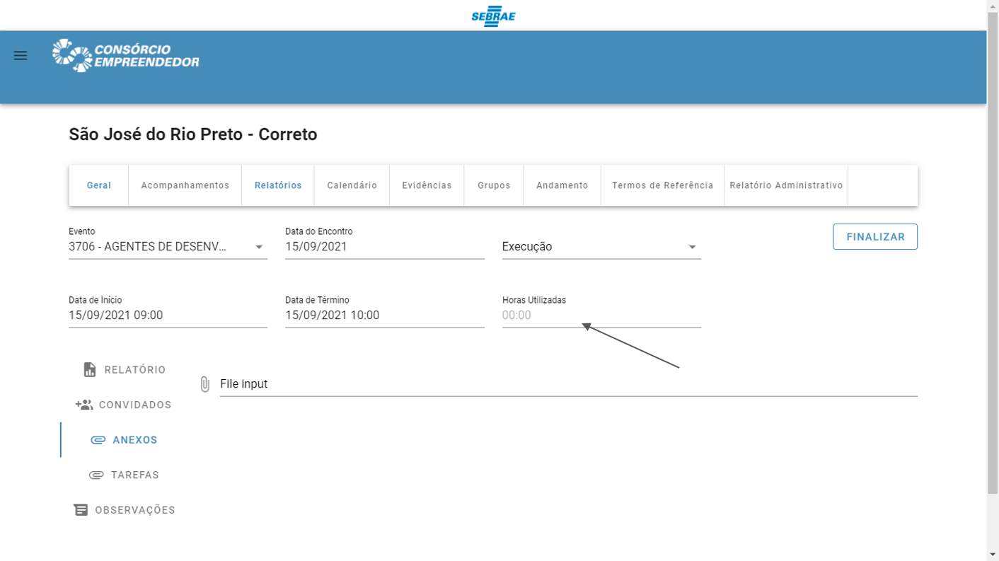
]]     
---
.center[.full-width[
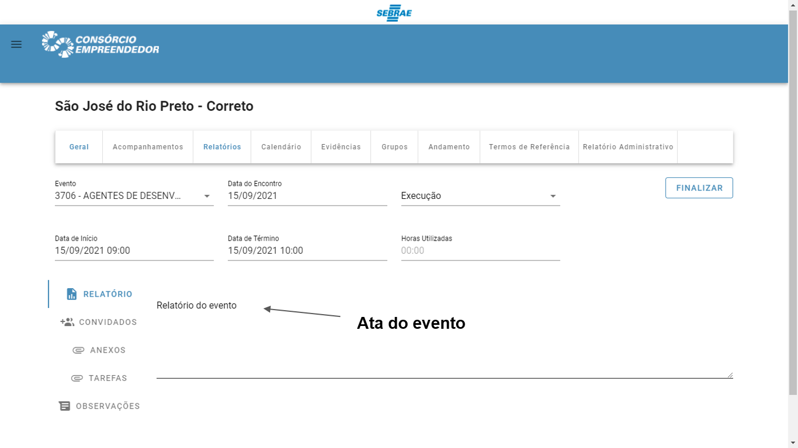
]]  
---
.center[.full-width[
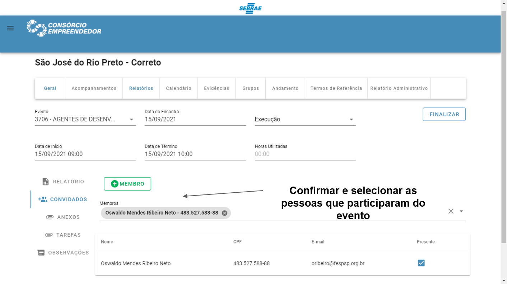
]]     

---
.center[.full-width[
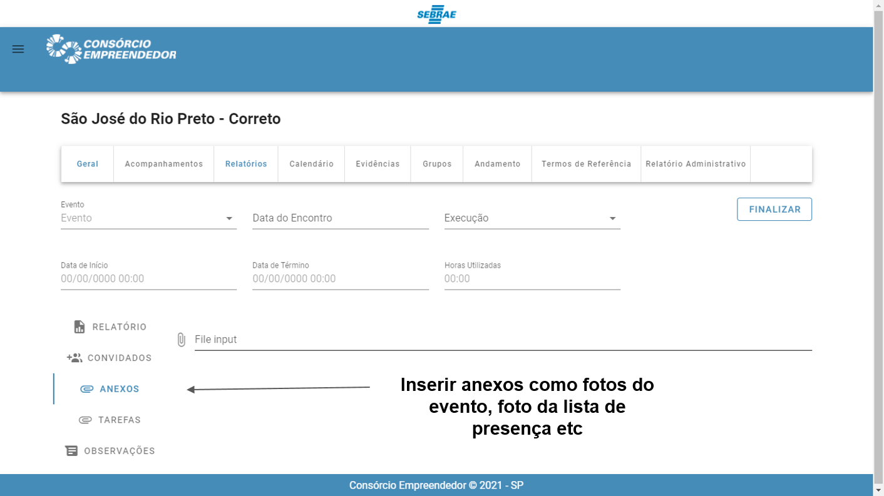
]]      

---
.center[.full-width[
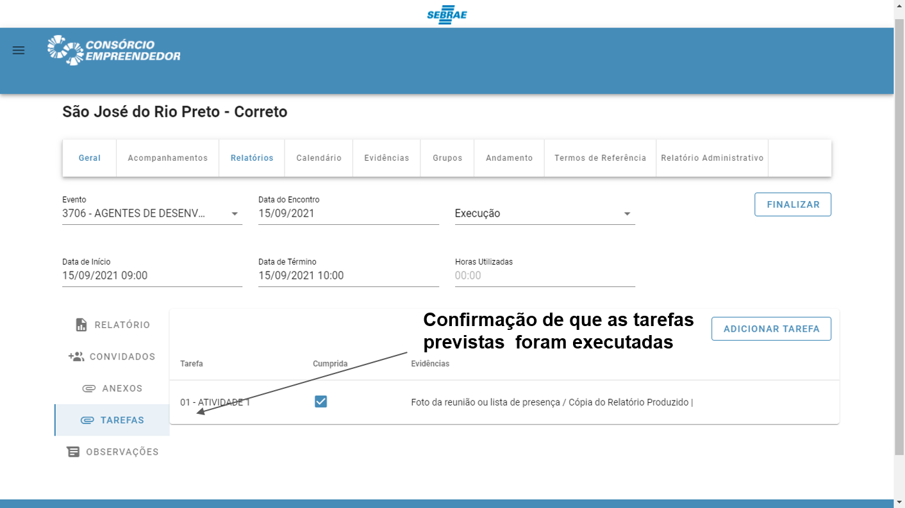
]]    

---
.center[.full-width[
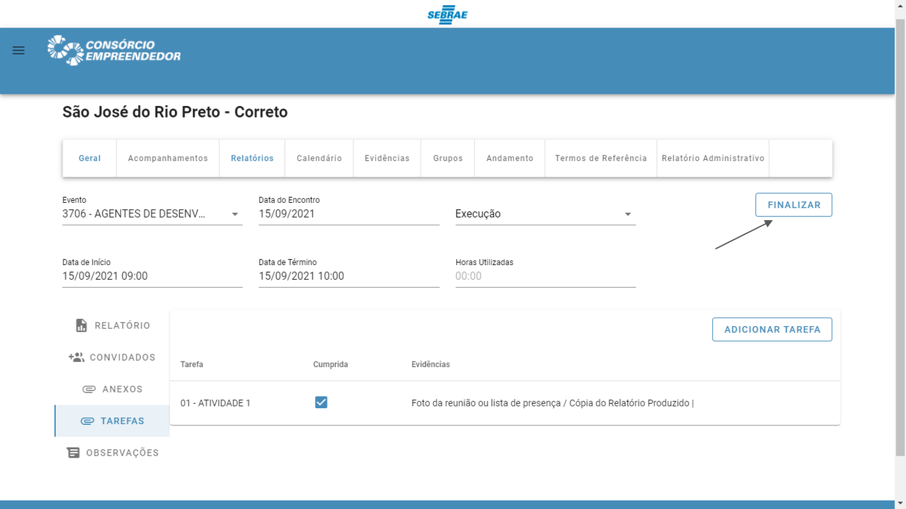
]]  
---
class: center, middle
# Obrigado!
