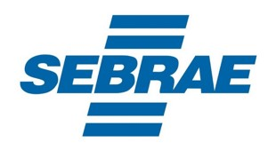
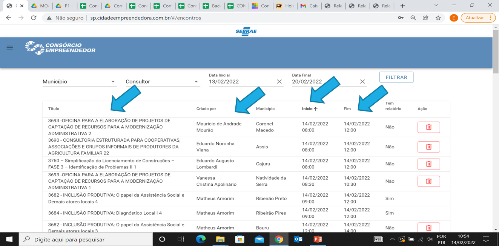
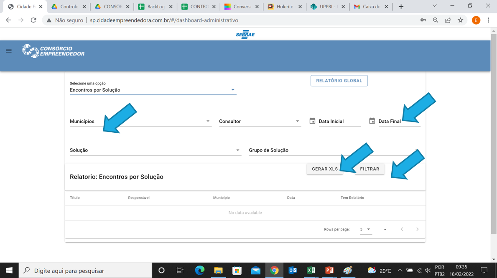

```{r setup, include=FALSE}
options(htmltools.dir.version = FALSE)
knitr::opts_chunk$set(
  fig.width=9, fig.height=3.5, fig.retina=3,
  out.width = "100%",
  cache = FALSE,
  echo = TRUE,
  message = FALSE, 
  warning = FALSE,
  hiline = TRUE
)
```

```{r xaringan-themer, include=FALSE, warning=FALSE}
library(xaringanthemer)
style_duo_accent(
  primary_color = "#1381B0",
  secondary_color = "#FF961C",
  inverse_header_color = "#FFFFFF"
)
```
```{r xaringan-extra, include=FALSE, warning=FALSE, echo=FALSE}
library(xaringanExtra)
use_xaringan_extra(
  c("tile_view", "panelset", "share_again", "editable")
)

use_scribble(
  pen_color = "#d33f49",
  pen_size = 4,
  palette = c("#d33f49", "#466683", "#338d70", "#c0af3f", "#ff6300")
)
```


class: center, middle
# Manual do Sistema de Gestão - Regionais SEBRAE

.pull-left[

]

.pull-right[

]

---
## Sumário

Link de acesso ao sistema....................................................................  
Logar no sistema..............................................................................  
Trocar a senha de acesso......................................................................  
Esqueci minha senha...........................................................................  
Visualizar e exportar encontros por solução...................................................  
Visualizar e exportar execução dos municípios.................................................

---
**Link do sistema:** [http://sp.cidadeempreendedora.com.br](http://sp.cidadeempreendedora.com.br/)  

**Login:** seu e-mail  

**Senha:** senha (Trocar no seu primeiro acesso)

.center[.full-width[

]]

---
Para realizar a troca de senha no primeiro acesso – Clicar em atualizar senha - Cadastrar uma nova senha e pronto.

.pull-left[

]

.pull-right[

]

---
Caso esqueça a senha de acesso, basta acessar a tela inicial de login, clicar em esqueci a senha, informar seu e-mail e clicar em solicitar recuperação de senha, será enviado para seu e-mail as instruções para recuperação da senha.


.pull-left[

]

.pull-right[

]

---
Visualizar agendamentos e encontros realizados - Clicar em “Encontros”

.center[.full-width[

]]

---
Realizar os filtros por município e data se necessário.

.center[.full.width[

]]

---
Após filtrar, irá aparecer todos os agendamentos futuros ou encontros realizados de acordo com as datas selecionadas e que estão cadastrados em sistema. É possível organizar a tabela através dos cabeçalhos.

.center[.full-width[

]]

---
É possível também visualizar e exportar para o Excel por aqui

.center[.full-width[

]]     

---
Clicar em Encontros por solução

.center[.full-width[

]]     
---
Após aplicar os filtros, clicar em filtrar e gerar XLS

.center[.full-width[

]]     

---
Para visualizar a Execução de horas realizadas x previstas do projeto, clicar em Dashboard Administrativo

.center[.full-width[

]]     

---
Clicar em Execução

.center[.full-width[

]]     

---
Aplicar os filtros de sua preferencia visualizar na tela ou exportar em Excel

.center[.full-width[

]]     

---
Após clicar em GERAR XLS, o arquivo estará disponível em downloads ou direto no canto inferior esquerdo.


.center[.full-width[

]]     

---
class: center, middle
# Obrigado!
